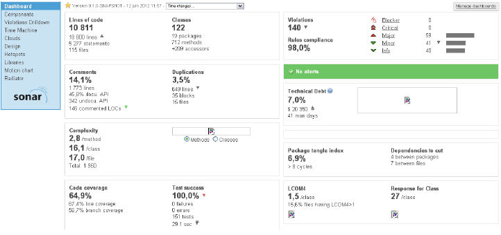

[TOC]

# Introduction

This document is a description of the design of the Tango Server API for Java developers. 
Tango is a framework based on CORBA (http://www.corba.org/). It allows software components to inter-communicate on a network upon a client/server model. Presently, Tango supports C++, Python and Java.
The Java API was only maintained on the client part; the server part was very old. Therefore, the server API has to be updated to same level of functionalities provided by the other Tango programming languages C++ and Python.
The main design change introduced by this new API is to do a compromise between taking advantage of the Java language and respecting the Tango philosophy. So that, a Java developer can easily start using the Tango API while a person who is already familiar with Tango (in C++ or Python), can use the Java API quickly. 
This document will not describe the Tango concepts so please refer to the Tango reference manual.
There is also another documentation which is a user manual of this API. It should be read before this document.

# Background

Here are some definitions about Tango:
* A server is a standalone instance that contains devices. 
* A device class is the definition of the behavior a device.
* A device is an object that is built from its class.  A server may have several devices of different classes. 

The administration device is a special device started automatically by the server.

Here is an example server “Insertion/test” with two device classes: “Motor” and “PowerSupply”. It contains four devices: two of class “Motor”, one of class” PowerSupply”, and one administration device:


The server will appear like this in the Tango Database (screenshot of Jive):


# Organization of the code

The source code is organized in 4 Java projects. 

The code is located on GitHub (https://github.com/tango-controls/JTango):

* IDL: contains the CORBA IDL ([Interface Description Language](http://en.wikipedia.org/wiki/Interface_description_language) ). 
Compiled with JacORB which the ORB choosen for Tango in Java
* TangORB: CORBA specific classes.
* JTangoCommons: contains utilities that may be used for client or server code.
* JTangoClientLang: contains Tango utilities for client code, especially the code for connecting to the Tango database that will be used in the server part.
* JTangoServer: code of the server API. Package overview:

  - org.tango.logging: to manage tango logging
  - org.tango.server : common classes
  - org.tango.server.admin : The administration device which is started for each server
  - org.tango.server.annotation : The definitions of all annotations
  - org.tango.server.attribute : All classes for managing attributes
  - org.tango.server.build : All classes for building a Java server.
  - org.tango.server.cache : All classes for managing caching (or polling threads)
  - org.tango.server.command :  All classes for managing commands
  - org.tango.server.device :All classes for managing a device
  - org.tango.server.dynamic : manage dynamic commands an attributes
  - org.tango.server.export : start-up / shutdown of the server 
  - org.tango.server.history: manage history of the server
  - org.tango.server.idl: utility classes to convert values to classes defined in IDL (AttributeValUnion for instance for attributes)
  - org.tango.server.lock: manage device locking
  - org.tango.server.properties: manage class, device, attribute properties
  - org.tango.server.schedule: to schedule tasks inside a device
  - org.tango.server.servant: manage the CORBA part of Tango (servant implementation)
  - org.tango.server.testserver: Test devices to perform unit tests.

The rest of this document will focus in details on the most important packages.

# JacORB

Tango is based on CORBA.  The chosen ORB is JacORB (http://www.jacorb.org). JacORB is widely used; for example JBoss (An application server http://www.jboss.org/) uses it. Its code is evolving constantly.

The only important points to know are:

* It is configurable with Java system properties: These properties can be passed as command line, properties files. All details are described in the JacORB documentation. It is only useful for fine tuning of the ORB, the default parameters are satisfactory. 
* It uses the logging API slf4j; see logging chapter for details. 

> NB: The class org.tango.orb.ORBManager overrides some properties like for instance:
>  - org.omg.CORBA.ORBClass,
>  - org.omg.CORBA.ORBSingletonClass, 
>  - jacorb.connection.client.connect_timeout,
>  - jacorb.implname needed for a device without tango database. 

# Device architecture

As every CORBA project, Tango has an IDL (Interface Description Language) that defines the interface of a Tango server and its client. Those IDL files are then compiled in the desired language. So the Java API has to extend the compiled IDL class Device_POA and implements its behavior for methods like:

* Read_attributes
* Write_attributes
* Command_inout

In the history of Tango, several versions of Device_POA have been defined. The latest version is the 4th one while the Java Server API was still in the 2nd one.  So, it is the latest one, Device_4POA that is used in the current version of the Java API.

The main difference introduced in this new API is to use the object-oriented programming technique of “Composition over inheritance”. The class defined by the user of this API is no more inherited from “DeviceImpl”. The following example shows the difference where the user has defined a device called “Motor”:


The main reason of this choice is to provide a more stable API. If the Device_POA or DeviceImpl classes evolve, the user device class (Motor in the example) will not have to change. Actually, this case is very likely to happen since a new Device_5POA is already planned. Here are some articles that explain why “Composition over inheritance” can be a good choice: 

http://www.javaworld.com/javaworld/jw-11-1998/jw-11-techniques.html, 

http://en.wikipedia.org/wiki/Composition_over_inheritance

http://lostechies.com/chadmyers/2010/02/13/composition-versus-inheritance/


# The Java annotations

Another novelty is to introduce the Java annotation (http://docs.oracle.com/javase/tutorial/java/javaOO/annotations.html) to describe the interface of a device.  The concept of annotations was introduced with Java language version 5. The best reason to use them is to provide a very clean and simple code. That way a device can may only contains some business code and no code related to the Tango framework. 

Here is a class code of simple device with one Tango command and one attribute:


Here is a first list of annotations defined for Tango:
* The __@Device__ annotation on the class defines this class as a Tango Device.
* The __@Attribute__annotation defines a field as a Tango attribute. 
  - The attribute type is defined by the field type.  
  - If this field has a getter, it is a READ attribute; 
  - if it has a setter, it is a WRITE attribute; 
  - if it has both getter and setter, it is a READ/WRITE attribute.
* The annotation __@Command__ defines a method as a Tango command:
  - The parameter type defines the input type
  - The return type defines the output type
* The __@Init__ annotation defines a method called at server startup and when “Init” command is called.
* The __@Delete__ annotation defines a method called at server shutdown and at “Init” command before “@Init”.

All the annotations definitions are defined the package _org.tango.server.annotation_.

These annotations are defined at runtime. It means the device and its interface are built at the start-up phase of the server.  This way of programming is very flexible; it was inspired by the software concept of component/container:
* The class that defines the device (the component), if it is used in the Tango context (the container), is a Tango device. 
* But outside the Tango context, the class can be re-used as a Java standard class (also known as POJO or Plain Old Java Object).

(http://www.cs.sjsu.edu/~pearce/modules/patterns/enterprise/Container.htm)
 
The mechanism of introspection that builds a Tango server is described in details in next chapter.

# Device discovery mechanism

This framework uses the Java reflection to build the device (http://en.wikipedia.org/wiki/Reflection_(computer_programming)).  The Java reflection API allows introspecting a code at runtime. For example, it is possible to ask a Java class to give its methods and fields:

```java
Class<?> clazz= Test.class;
Field[] fields = clazz.getFields();
Method[] methods = clazz.getMethods();
```

To build a Java device, the user will have to provide the class of the device to the framework. It will then introspect this class to retrieve all its attributes, commands, properties… The following example code gives the class “TestDevice” to the framework that will build the server depending of its annotations:

```java
ServerManager.getInstance().start(args, TestDevice.class);
```

Here is a simplified code example of how attributes are retrieved:
```java
// get fields
final Field[] fields = clazz.getFields();
for (final Field field : fields) {
    if(field.isAnnotationPresent(Attribute.class)) {
	Attribute  annotation = field.getAnnotation(Attribute.class);
	// build attribute
	String attributeName= annotation.name();
	AttributeImpl attribute = new AttributeImpl(...);
	//...
    }
}
```

All the reflection code is located in the package _org.tango.server.build_.

# Architecture

For each class annotated __@Device__, an instance of its CORBA servant is built. Its code is located in the package org.tango.server.servant. The servant, called “DeviceImpl”, is where all the Tango operations are effectively executed.  It inherits from the CORBA IDL stub “Device_4POA”. So DeviceImpl overrides all abstract methods defined by the Tango IDL like for instance:
* Command_inout_4: to execute a command.
* Read_attributes_4: to read some attributes.
* Write_attributes_4: to write some attributes.

DeviceImpl contains an instance of the business class which defines the behavior of the device (the class of the device annotated @Device), the attribute and command lists. So, for example, when a client requests for an attribute value, it will:

* Call read_attributes_4
* This call will be then delegated the class that manages the attribute (AttributeImpl)
* And then get the value from the business class.


The implementation of attributes and commands is detailed in next chapter. The class DeviceImpl contains also the implementation for default attributes and commands:

* Commands “Init”, “State”, “Status”.
* Attributes “State”, “Status”.

> NB: When __@Device__ is configured with the option __@Device__(transactionType = TransactionType._NONE_), a Tango device is able to support several client requests in parallel. The exceptions are:
> * The “Init” command that can only be executed once at a time. 
> * An attribute can only be read once at a time, since it contains many data like read value and write value…that have to be managed atomically. On the contrary, a command has only on return value, so there no need to synchronize it.  
>
> JacORB has many parameters to configure client concurrency (like jacorb.poa.queue_max, jacorb.poa.queue_min or jacorb.poa.thread_pool… Please, refer JacORB documentation for details). 

## Init phase

When the Init command is executed or when a device starts, many things are done:
* Calls the user method @Delete if exists.
* Retrieved all properties from the tango database
* Restarts polling
* Calls the user method __@Init__ if exists.

Init never fails, it will catch all errors and report them in the status of the device; the device will be in FAULT state. This mechanism allows a server to always start; even an underlying resource is not available. It simplifies a lot the start-up phase of a control system. If a server does not start, you would have to connect to the host that runs the server, launch it in command line and pray that its developer has logged something…

The __@Init__ method can also be detached in another thread. It is particularly useful when its execution takes a lot of time and clients receive timeouts. So, in this case, the command return immediately and the device switches to INIT state while the thread is executed.  

The code for managing __@Init__ is in _org.tango.server.device.InitImpl_, the Init command code is in DeviceImpl class.

## Attributes & commands

The code for attributes and commands is located in the packages org.tango.server.attribute and org.tango.server.command. As described previously, the attributes and commands of a device are discovered at runtime:
* For each attribute, an instance of AttributeImpl will be build.
* For each command, an instance of CommandImpl will be build.

The attribute and command design follow the same principle: 
* Their behaviors are delegated to some interfaces, respectively IAttributeBehavior and ICommandBehavior. 
* Those interfaces have default implementations ReflectAttributeBehavior and ReflectCommandBehavior; which are the behavior defined by the annotations @Attribute and @Command. They will invoke the annotated method defined in the user device with the Java reflection API.
* The user may also implements IAttributeBehavior or ICommandBehavior to define dynamic attributes or commands. 

Here is a class diagram for a device with command and attribute. The user defines its code :
* Either in the class “BusinessClass” with the help of the annotations @Attribute and @Commands
* Either in classes that implements IAttributeBehavior or ICommandBehavior (MyDynamicAttribute and MyDynamicCommand)


> NB: With this design, it is possible to have different dynamic commands and attributes for several devices running in the same server.

## Other functionalities

All others functionalities of this framework follow the same principal:
* __@Init__ is managed by org.tango.server.device.InitImpl
* __@State__ is managed by org.tango.server.device.StateImpl
* __@Status__ is managed by org.tango.server.device.StatusImpl
* __@AroundInvoke__ is managed by org.tango.server.device. AroundInvokeImpl
* …

# Polling

All attributes and all commands without parameters can be polled. There will be invoked periodically and their results will be retained in history buffers.  The polling functionality has been implemented using the ehcache library (http://ehcache.org/). The code is located in the package org.tango.server.cache. Polling is done by a pool of threads. The number of threads is configurable with the administration device property “polling_threads_pool_size”.

The history buffers are managed in class org.tango.server.attribute.AttributeHistory and org.tango.server.command.CommandHistory. They can be retrieved from a client with command_inout_history_4 or read_attribute_history_4.

# Blackbox

A device maintains a history of all client requests. It contains the request name, timestamp and client identification. The client host name and IP are retrieved with CORBA interceptors. They are able to intercept all client requests and their contents.  The code is located in org.tango.orb.ServerRequestInterceptor.

# Administration device

For each Tango server, a special device is started, the administration device (class org.tango.server.admin.AdminDevice). The device name pattern is dserver/ServerName.

It has the same commands as in the other Tango APIs like:
* DevPollingStatus: get an array of strings with the polling status.
* DevRestart: restart a device of the server.
* RestartServer: restart the entire server.
* Kill: kill the server process.
* Start/StopPolling: ….

# Server start-up / shutdown

The entry point to start or stop a server is the class org.tango.server.ServerManager which is a singleton. It has several options:
- A server can be started with or without a Tango database.
- A server can contain several device classes.

Since this class is a singleton, its means that only one server at a time can be running in a JVM (Java Virtual Machine).

When a server starts, it builds an instance of org.tango.server.export.TangoExporter that will:
1. Retrieve all interfaces of classes of the server by introspection
2. Ask tango db if server is declared
3. If yes, ask tango db for classes and devices declared in the server
4. If yes, check if the server is already started somewhere else
5. If no, start the administration device
6. For each device, start its CORBA server
7. Inform the tango db of its CORBA address (called IOR)

If one of these steps fails, the server will not start. The TangoExporter class has also some method to unexport everything. TangoExporter is also used by the administration device for commands Kill, RestartServer and DevRestart.

# Unit Tests
 
The package org.tango.server.testserver contains device classes for unit test purposes. The unit tests code is located in the directory src/test/java.  It is based on the JUnit framework (http://www.junit.org/). Most of the tests are done with device without tango database. It means that they can run in a standalone way; the tests will start and stop the devices automatically. Some of them need a tango database and a server registered (HistoryTest, PropertyTest, AlreadyRunningTest).

# Quality monitor

This API has been designed to maintain the highest standards of quality.  The code is constantly monitored by the sonar tool (http://www.sonarsource.org/). Here is an example screenshot that gives an overview of the JTangoServer library:



Of course, the current version is not perfect and some improvements are continually needed!

# Tango database management

The code located in the package org.tango.client.database and org.tango.client.database.cache of the project JTangoClientLang manages the connection to the tango database. It has several implementations:
* Client of the database device
* Local file implementation

Client of the Database device:

It is managed by the class org.tango.client.database.Database. It has two implementations: one with a cache, and the other that will request the database device for each request (i.e. device property, attribute property…). 

The cache version will be automatically active if the cache procedure version 1.7 or 1.8 is available on the device database. This procedure is available if the database device has the attribute “StoredProcedureRelease” with a value of “release 1.7” or “release 1.8”. This cache is used at server startup; it will request once all the information needed by the server. This cache will be disabled at the end of the start-up phase.

Local file:

It is managed by the class org.tango.client.database.FileTangoDB. When running a device without database, a file that contains class and device properties can be provided to replace the database. But some information, like the attribute properties, will not be persisted. 

The factory org.tango.client.database.DatabaseFactory will be used to retrieve the choosen implementation.

All the details to start a server with or without database are in the user documentation.

# Servers threads

Here is a sample screenshot of a server threads done with VisualVM (http://visualvm.java.net/)


* ServerSocketListener, ClientMessageReceptorX, RequestProcessor-X ORB run: JaCORB threads. RequestProcessor-X manages client requests. It where commands and attributes are executed. The thread name can be visible in the logs:
  ```
  DEBUG 15:44:23.889 [RequestProcessor-5 - tmp/test/simpledevice] org.tango.server.servant.DeviceImpl.commandHandler:1650 - execute command State from DEVICE
  ```
* Devicename Init: thread for device initialization.
* Polling thread X: threads used for polling.
* RMIxxx, JMX…: VisualVM threads
* The other threads are internal for the JVM.

# Logging

The logging is realized with SLF4J (http://www.slf4j.org/).  SLF4J is an abstraction layer for various logging frameworks (ie. logback, log4j, java.util.logging…).  It allows the end user to choose the logging framework at deployment time. Nevertheless, the logging configuration is framework dependent. 
Each class has its own logger. It allows a fine tuning for debugging:
```java
private final Logger logger = LoggerFactory.getLogger(DeviceImpl.class);
```

Here is an example (extract of a logback xml logging file http://logback.qos.ch/) to have debug logs for a class:
```xml
<logger name="org.tango.server.servant.DeviceImpl" level="DEBUG" />
```

Since all server code is located in packages starting by “org.tango”, it is also possible to configure like this:
```xml
<logger name="org.tango" level="DEBUG" />
```
 
The JaCORB and EHCache libraries logging can also be configured. JaCORB has only one logger:
```xml
<logger name="jacorb" level="ERROR" />
```

Please refer the logging libraries documentations for further details on their configuration.

An extension of sfl4j (class org.slf4j.ext.XLogger) is also used to log all entries and exits of methods. It will be visible if the logging level is set to “TRACE”.

## Special appenders

Some logging appenders have been added to:
* Send logs of a device to the logging device (which is provided with the tango logviewer application): the logs are sent asynchrounsly with the command “Log”.
* Send logs of a device to a file.

These appenders are configurable through commands of the administration device (AddLoggingTarget and RemoveLoggingTarget). 

As SLF4J is just an abstraction, it does not define interfaces for appenders. So the appenders have been designed by implementing interfaces of the logging API logback (http://logback.qos.ch/ ).