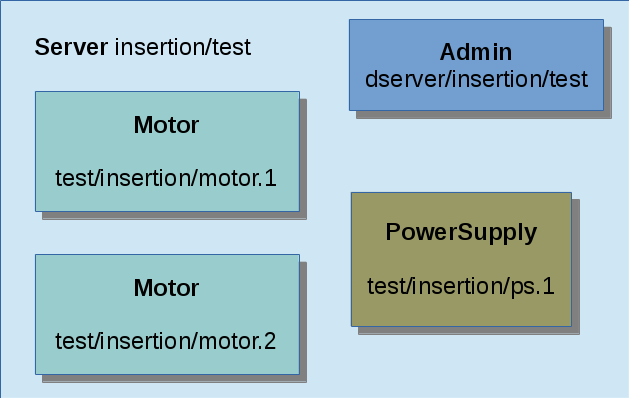
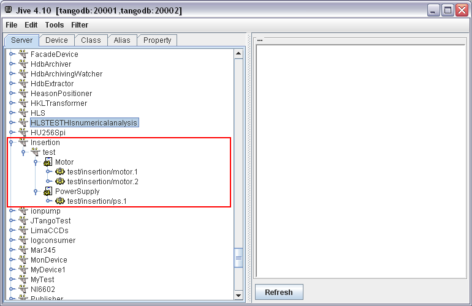
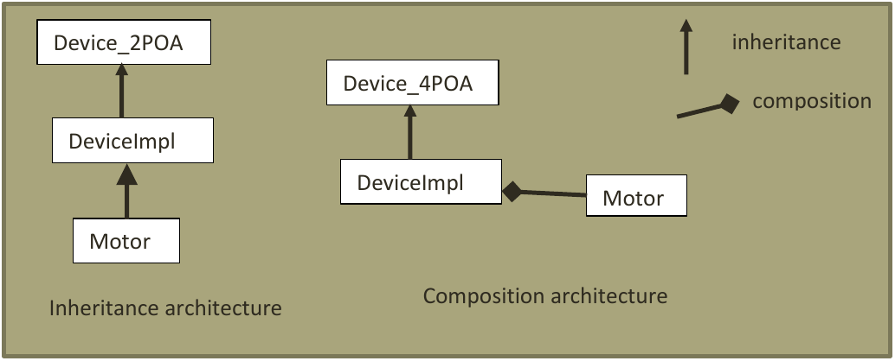
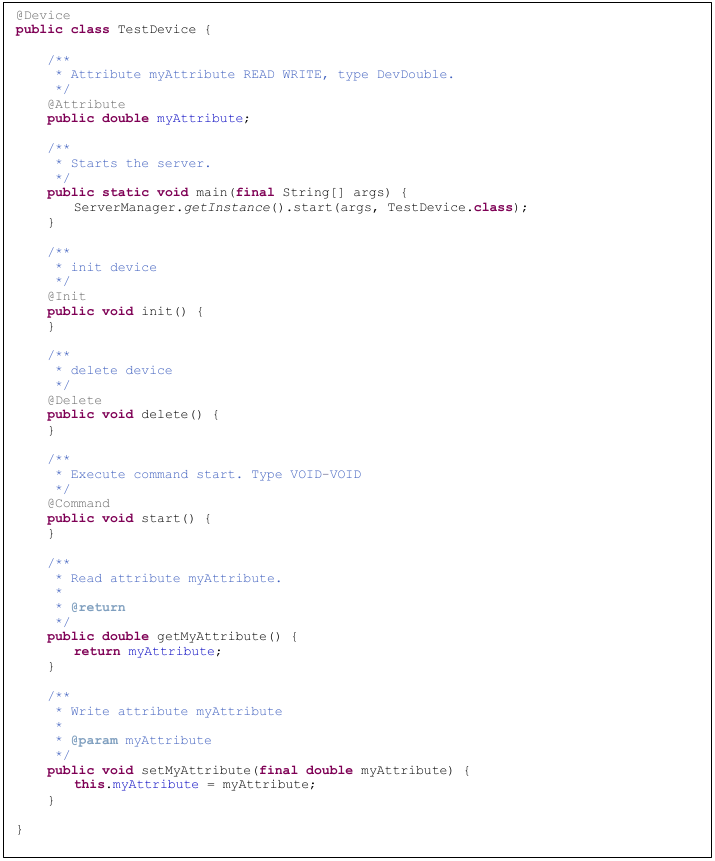

This document is a description of the design of the Tango Server API for Java developers. 
Tango is a framework based on CORBA (http://www.corba.org/). It allows software components to inter-communicate on a network upon a client/server model. Presently, Tango supports C++, Python and Java.
The Java API was only maintained on the client part; the server part was very old. Therefore, the server API has to be updated to same level of functionalities provided by the other Tango programming languages C++ and Python.
The main design change introduced by this new API is to do a compromise between taking advantage of the Java language and respecting the Tango philosophy. So that, a Java developer can easily start using the Tango API while a person who is already familiar with Tango (in C++ or Python), can use the Java API quickly. 
This document will not describe the Tango concepts so please refer to the Tango reference manual.
There is also another documentation which is a user manual of this API. It should be read before this document.

# Background

Here are some definitions about Tango:

* A server is a standalone instance that contains devices. 

* A device class is the definition of the behavior a device.

* A device is an object that is built from its class.  A server may have several devices of different classes. 

The administration device is a special device started automatically by the server.

Here is an example server “Insertion/test” with two device classes: “Motor” and “PowerSupply”. It contains four devices: two of class “Motor”, one of class” PowerSupply”, and one administration device:



The server will appear like this in the Tango Database (screenshot of Jive):



# Organization of the code

The source code is organized in 4 Java projects. 

The code is located on GitHub (https://github.com/tango-controls/JTango):

* IDL: contains the CORBA IDL ([Interface Description Language](http://en.wikipedia.org/wiki/Interface_description_language) ). 
Compiled with JacORB which the ORB choosen for Tango in Java

* TangORB: CORBA specific classes.

* JTangoCommons: contains utilities that may be used for client or server code.

* JTangoClientLang: contains Tango utilities for client code, especially the code for connecting to the Tango database that will be used in the server part.

* JTangoServer: code of the server API. Package overview:

    - org.tango.logging: to manage tango logging
    - org.tango.server : common classes
    - org.tango.server.admin : The administration device which is started for each server
    - org.tango.server.annotation : The definitions of all annotations
    - org.tango.server.attribute : All classes for managing attributes
    - org.tango.server.build : All classes for building a Java server.
    - org.tango.server.cache : All classes for managing caching (or polling threads)
    - org.tango.server.command :  All classes for managing commands
    - org.tango.server.device :All classes for managing a device
    - org.tango.server.dynamic : manage dynamic commands an attributes
    - org.tango.server.export : start-up / shutdown of the server 
    - org.tango.server.history: manage history of the server
    - org.tango.server.idl: utility classes to convert values to classes defined in IDL (AttributeValUnion for instance for attributes)
    - org.tango.server.lock: manage device locking
    - org.tango.server.properties: manage class, device, attribute properties
    - org.tango.server.schedule: to schedule tasks inside a device
    - org.tango.server.servant: manage the CORBA part of Tango (servant implementation)
    - org.tango.server.testserver: Test devices to perform unit tests.

The rest of this document will focus in details on the most important packages.

# JacORB

Tango is based on CORBA.  The chosen ORB is JacORB (http://www.jacorb.org). JacORB is widely used; for example JBoss (An application server http://www.jboss.org/) uses it. Its code is evolving constantly.

The only important points to know are:

* It is configurable with Java system properties: These properties can be passed as command line, properties files. All details are described in the JacORB documentation. It is only useful for fine tuning of the ORB, the default parameters are satisfactory. 

* It uses the logging API slf4j; see logging chapter for details. 

> NB: The class org.tango.orb.ORBManager overrides some properties like for instance:
>  - org.omg.CORBA.ORBClass,
>  - org.omg.CORBA.ORBSingletonClass, 
>  - jacorb.connection.client.connect_timeout,
>  - jacorb.implname needed for a device without tango database. 

# Device architecture

As every CORBA project, Tango has an IDL (Interface Description Language) that defines the interface of a Tango server and its client. Those IDL files are then compiled in the desired language. So the Java API has to extend the compiled IDL class Device_POA and implements its behavior for methods like:

* Read_attributes

* Write_attributes

* Command_inout

In the history of Tango, several versions of Device_POA have been defined. The latest version is the 4th one while the Java Server API was still in the 2nd one.  So, it is the latest one, Device_4POA that is used in the current version of the Java API.

The main difference introduced in this new API is to use the object-oriented programming technique of “Composition over inheritance”. The class defined by the user of this API is no more inherited from “DeviceImpl”. The following example shows the difference where the user has defined a device called “Motor”:



The main reason of this choice is to provide a more stable API. If the Device_POA or DeviceImpl classes evolve, the user device class (Motor in the example) will not have to change. Actually, this case is very likely to happen since a new Device_5POA is already planned. Here are some articles that explain why “Composition over inheritance” can be a good choice: 

http://www.javaworld.com/javaworld/jw-11-1998/jw-11-techniques.html, 

http://en.wikipedia.org/wiki/Composition_over_inheritance

http://lostechies.com/chadmyers/2010/02/13/composition-versus-inheritance/


# The Java annotations

Another novelty is to introduce the Java annotation (http://docs.oracle.com/javase/tutorial/java/javaOO/annotations.html) to describe the interface of a device.  The concept of annotations was introduced with Java language version 5. The best reason to use them is to provide a very clean and simple code. That way a device can may only contains some business code and no code related to the Tango framework. 

Here is a class code of simple device with one Tango command and one attribute:



Here is a first list of annotations defined for Tango:

* The __@Device__ annotation on the class defines this class as a Tango Device.

* The __@Attribute__annotation defines a field as a Tango attribute. 
    - The attribute type is defined by the field type.  
    - If this field has a getter, it is a READ attribute; 
    - if it has a setter, it is a WRITE attribute; 
    - if it has both getter and setter, it is a READ/WRITE attribute.

* The annotation __@Command__ defines a method as a Tango command:
    - The parameter type defines the input type
    - The return type defines the output type

* The __@Init__ annotation defines a method called at server startup and when “Init” command is called.

* The __@Delete__ annotation defines a method called at server shutdown and at “Init” command before __@Init__.

All the annotations definitions are defined the package _org.tango.server.annotation_.

These annotations are defined at runtime. It means the device and its interface are built at the start-up phase of the server.  This way of programming is very flexible; it was inspired by the software concept of component/container:

* The class that defines the device (the component), if it is used in the Tango context (the container), is a Tango device. 

* But outside the Tango context, the class can be re-used as a Java standard class (also known as POJO or Plain Old Java Object).

(http://www.cs.sjsu.edu/~pearce/modules/patterns/enterprise/Container.htm)
 
The mechanism of introspection that builds a Tango server is described in details in next chapter.

# Device discovery mechanism

This framework uses the Java reflection to build the device (http://en.wikipedia.org/wiki/Reflection_(computer_programming)).  The Java reflection API allows introspecting a code at runtime. For example, it is possible to ask a Java class to give its methods and fields:

```java
Class<?> clazz= Test.class;
Field[] fields = clazz.getFields();
Method[] methods = clazz.getMethods();
```

To build a Java device, the user will have to provide the class of the device to the framework. It will then introspect this class to retrieve all its attributes, commands, properties… The following example code gives the class “TestDevice” to the framework that will build the server depending of its annotations:

```java
ServerManager.getInstance().start(args, TestDevice.class);
```

Here is a simplified code example of how attributes are retrieved:
```java
// get fields
final Field[] fields = clazz.getFields();
for (final Field field : fields) {
    if(field.isAnnotationPresent(Attribute.class)) {
	Attribute  annotation = field.getAnnotation(Attribute.class);
	// build attribute
	String attributeName= annotation.name();
	AttributeImpl attribute = new AttributeImpl(...);
	//...
    }
}
```

All the reflection code is located in the package _org.tango.server.build_.


