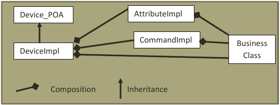
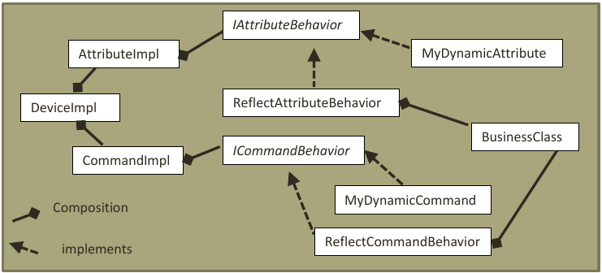

For each class annotated __@Device__, an instance of its CORBA servant is built. Its code is located in the package org.tango.server.servant. The servant, called “DeviceImpl”, is where all the Tango operations are effectively executed.  It inherits from the CORBA IDL stub “Device_4POA”. So DeviceImpl overrides all abstract methods defined by the Tango IDL like for instance:

* Command_inout_4: to execute a command.

* Read_attributes_4: to read some attributes.

* Write_attributes_4: to write some attributes.

DeviceImpl contains an instance of the business class which defines the behavior of the device (the class of the device annotated @Device), the attribute and command lists. So, for example, when a client requests for an attribute value, it will:

* Call read_attributes_4

* This call will be then delegated the class that manages the attribute (AttributeImpl)

* And then get the value from the business class.

The implementation of attributes and commands is detailed in next chapter. The class DeviceImpl contains also the implementation for default attributes and commands:

* Commands “Init”, “State”, “Status”.

* Attributes “State”, “Status”.

> NB: When __@Device__ is configured with the option __@Device__(transactionType = TransactionType._NONE_), a Tango device is able to support several client requests in parallel. The exceptions are:
> * The “Init” command that can only be executed once at a time. 
> * An attribute can only be read once at a time, since it contains many data like read value and write value…that have to be managed atomically. On the contrary, a command has only on return value, so there no need to synchronize it.  
>
> JacORB has many parameters to configure client concurrency (like jacorb.poa.queue_max, jacorb.poa.queue_min or jacorb.poa.thread_pool… Please, refer JacORB documentation for details). 

## Init phase

When the Init command is executed or when a device starts, many things are done:

* Calls the user method @Delete if exists.

* Retrieved all properties from the tango database

* Restarts polling

* Calls the user method __@Init__ if exists.

Init never fails, it will catch all errors and report them in the status of the device; the device will be in FAULT state. This mechanism allows a server to always start; even an underlying resource is not available. It simplifies a lot the start-up phase of a control system. If a server does not start, you would have to connect to the host that runs the server, launch it in command line and pray that its developer has logged something…

The __@Init__ method can also be detached in another thread. It is particularly useful when its execution takes a lot of time and clients receive timeouts. So, in this case, the command return immediately and the device switches to INIT state while the thread is executed.  

The code for managing __@Init__ is in _org.tango.server.device.InitImpl_, the Init command code is in DeviceImpl class.

## Attributes & commands

The code for attributes and commands is located in the packages org.tango.server.attribute and org.tango.server.command. As described previously, the attributes and commands of a device are discovered at runtime:

* For each attribute, an instance of AttributeImpl will be build.

* For each command, an instance of CommandImpl will be build.

The attribute and command design follow the same principle: 

* Their behaviors are delegated to some interfaces, respectively IAttributeBehavior and ICommandBehavior. 

* Those interfaces have default implementations ReflectAttributeBehavior and ReflectCommandBehavior; which are the behavior defined by the annotations @Attribute and @Command. They will invoke the annotated method defined in the user device with the Java reflection API.

* The user may also implements IAttributeBehavior or ICommandBehavior to define dynamic attributes or commands. 

Here is a class diagram for a device with command and attribute. The user defines its code :

* Either in the class “BusinessClass” with the help of the annotations @Attribute and @Commands

* Either in classes that implements IAttributeBehavior or ICommandBehavior (MyDynamicAttribute and MyDynamicCommand)

> NB: With this design, it is possible to have different dynamic commands and attributes for several devices running in the same server.

## Other functionalities

All others functionalities of this framework follow the same principal:

* __@Init__ is managed by org.tango.server.device.InitImpl

* __@State__ is managed by org.tango.server.device.StateImpl

* __@Status__ is managed by org.tango.server.device.StatusImpl

* __@AroundInvoke__ is managed by org.tango.server.device. AroundInvokeImpl

* …

# Polling

All attributes and all commands without parameters can be polled. There will be invoked periodically and their results will be retained in history buffers.  The polling functionality has been implemented using the ehcache library (http://ehcache.org/). The code is located in the package org.tango.server.cache. Polling is done by a pool of threads. The number of threads is configurable with the administration device property “polling_threads_pool_size”.

The history buffers are managed in class org.tango.server.attribute.AttributeHistory and org.tango.server.command.CommandHistory. They can be retrieved from a client with command_inout_history_4 or read_attribute_history_4.

# Blackbox

A device maintains a history of all client requests. It contains the request name, timestamp and client identification. The client host name and IP are retrieved with CORBA interceptors. They are able to intercept all client requests and their contents.  The code is located in org.tango.orb.ServerRequestInterceptor.

# Administration device

For each Tango server, a special device is started, the administration device (class org.tango.server.admin.AdminDevice). The device name pattern is dserver/ServerName.

It has the same commands as in the other Tango APIs like:

* DevPollingStatus: get an array of strings with the polling status.

* DevRestart: restart a device of the server.

* RestartServer: restart the entire server.

* Kill: kill the server process.

* Start/StopPolling: ….

# Server start-up / shutdown

The entry point to start or stop a server is the class org.tango.server.ServerManager which is a singleton. It has several options:

- A server can be started with or without a Tango database.

- A server can contain several device classes.

Since this class is a singleton, its means that only one server at a time can be running in a JVM (Java Virtual Machine).

When a server starts, it builds an instance of org.tango.server.export.TangoExporter that will:

1. Retrieve all interfaces of classes of the server by introspection
2. Ask tango db if server is declared
3. If yes, ask tango db for classes and devices declared in the server
4. If yes, check if the server is already started somewhere else
5. If no, start the administration device
6. For each device, start its CORBA server
7. Inform the tango db of its CORBA address (called IOR)

If one of these steps fails, the server will not start. The TangoExporter class has also some method to unexport everything. TangoExporter is also used by the administration device for commands Kill, RestartServer and DevRestart.