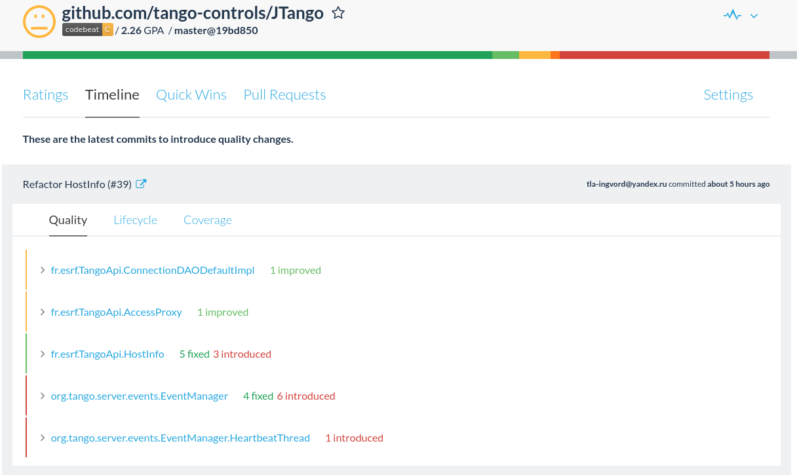
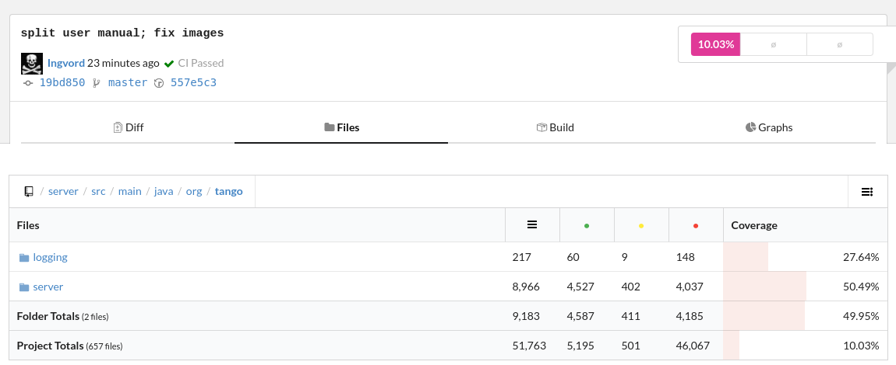
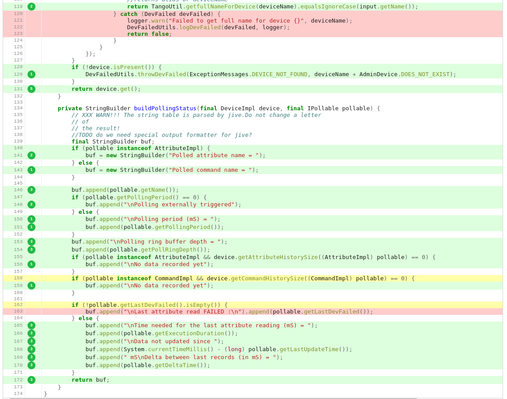
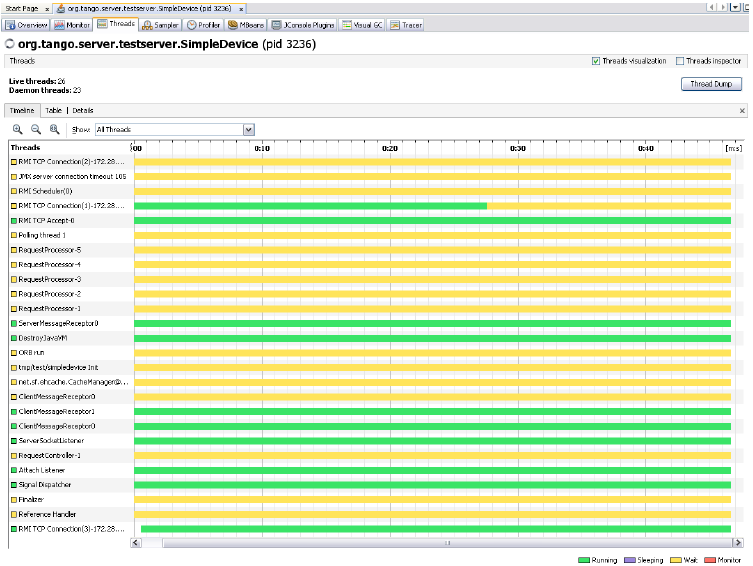

# Unit Tests
 
The package _org.tango.server.testserver_ contains device classes for unit test purposes. The unit tests code is located in the directory src/test/java.  It is based on the JUnit framework (http://www.junit.org/). Most of the tests are done with device without tango database. It means that they can run in a standalone way; the tests will start and stop the devices automatically. Some of them need a tango database and a server registered (HistoryTest, PropertyTest, AlreadyRunningTest).

# Quality monitor

This API has been designed to maintain the highest standards of quality.  The code is constantly monitored by 3rd party tools available on GitHub. Here is an example screenshot that gives an overview of the JTangoServer library:


Sample screenshot of Codebeat (https://codebeat.co/projects/github-com-tango-controls-jtango-master) dashboard



Sample screenshots of Codecov (https://codecov.io/gh/tango-controls/JTango)





Of course, the current version is not perfect and some improvements are continually needed!

# Tango database management

The code located in the package org.tango.client.database and org.tango.client.database.cache of the project JTangoClientLang manages the connection to the tango database. It has several implementations:
* Client of the database device
* Local file implementation

Client of the Database device:

It is managed by the class org.tango.client.database.Database. It has two implementations: one with a cache, and the other that will request the database device for each request (i.e. device property, attribute property…). 

The cache version will be automatically active if the cache procedure version 1.7 or 1.8 is available on the device database. This procedure is available if the database device has the attribute “StoredProcedureRelease” with a value of “release 1.7” or “release 1.8”. This cache is used at server startup; it will request once all the information needed by the server. This cache will be disabled at the end of the start-up phase.

Local file:

It is managed by the class org.tango.client.database.FileTangoDB. When running a device without database, a file that contains class and device properties can be provided to replace the database. But some information, like the attribute properties, will not be persisted. 

The factory org.tango.client.database.DatabaseFactory will be used to retrieve the choosen implementation.

All the details to start a server with or without database are in the user documentation.

# Servers threads

Here is a sample screenshot of a server threads done with VisualVM (http://visualvm.java.net/)



* ServerSocketListener, ClientMessageReceptorX, RequestProcessor-X ORB run: JaCORB threads. RequestProcessor-X manages client requests. It where commands and attributes are executed. The thread name can be visible in the logs:
  ```
  DEBUG 15:44:23.889 [RequestProcessor-5 - tmp/test/simpledevice] org.tango.server.servant.DeviceImpl.commandHandler:1650 - execute command State from DEVICE
  ```
* Devicename Init: thread for device initialization.

* Polling thread X: threads used for polling.

* RMIxxx, JMX…: VisualVM threads

* The other threads are internal for the JVM.