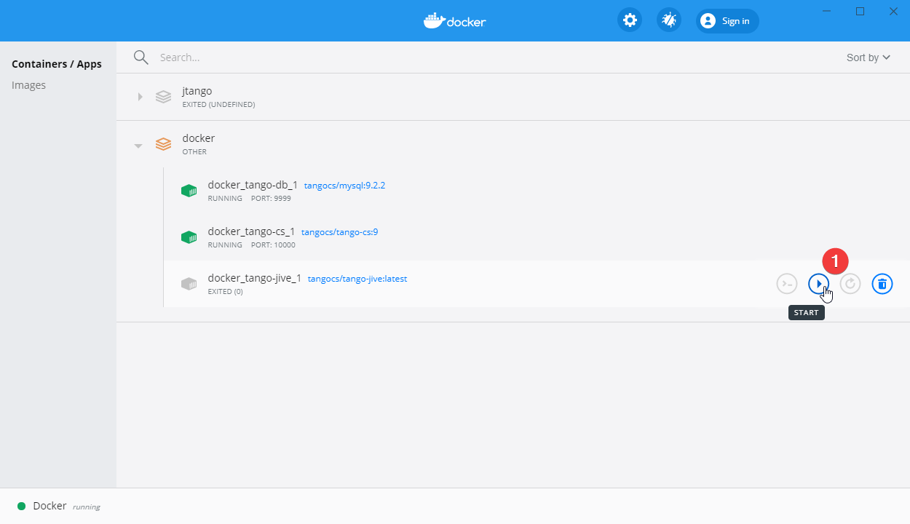

## Dockerized JTango server's

The goal of this page is to describe the way of running the Tango CS as a docker containers 
with the example Device Server (base on the JTango).

This document gives a step-by-step guide to prepare the local environment ready for development purposes.

### Pre-requirements

Software that is required to reproduce this guide.

#### JTango general requirements

|Software|Version|
|---|---|
|Java|8|
|Maven|3|

#### Docker requirements

|Software|Version|
|---|---|
|Docker Engine|19.03|
|Docker Compose|3.8|

Only for windows OS

|Software|Version|
|---|---|
|Docker Desktop (optional)|2.5.0.1|
|XMing|1.20|

Also is required the https://github.com/tango-controls/JTango repository cloned to the workstation.

### Building the example JTango device server 

As an example device server the `org.tango.server.testserver.TestDevice` was selected to present the:
- generating the **.jar**
- building the image
- installing and running a new device server in the Tango CS

#### Prepare the Device Server jar file

This example device server can be replaced by any of the classes in the `org.tango.server.testserver` package. 
Also, new JTango server implementation can be provided in a custom `*.jar` file, is only one condition 
the file name should start with **JTangoServer-\*.jar**, and user should copy this file in the **docker** folder.

To generate the .jar file (provided by the JTango) use command:

```shell script
mvn clean install
```

This will generate the `JTangoServer-${VERSION}-jar-with-dependencies.jar` in the **docker** directory.

#### Build the Device Server Docker image

In the **docker** folder, the `Dokcerfile` was prepared.
By using this file docker will build the new Device Server Docker image.

This file defines the system variables name **DEVICE_SERVER_CLASS**.
The default is the TestDevice class.

```docker
ENV DEVICE_SERVER_CLASS org.tango.server.testserver.TestDevice
```

To run the custom device server, this value can be changed (in this file) to provide information about what device server we want to run. 
Also, is possible to override this variable during the starting the container:

```shell script
docker run -e DEVICE_SERVER_CLASS=org.custom.CustomClass
```

To build the docker image is need to run in the **docker** folder following command:

```shell script
cd docker
docker build -t jtango-test:latest .
``` 

### Starting the local environment

To run the built image in the previous step is need to start the Tango CS. 
For this purpose, the docker-compose.yml file was prepared. This file will start:

- docker_tango-cs - container with the Tango host
- docker_tango-db - container with the Tango db
- docker_tango-jive - jive application to work with Tango CS

Before starting the Tango CS, in Windows OS user must start the *XMing* X server.
See: http://www.straightrunning.com/XmingNotes/

Is also need to update the 34 line in the docker-compose.yml file:

```yaml
#FIXME
- DISPLAY=${YOUR_WORKSTATION_IP_ADDRESS}:0.0
```

with the IP address of your workstation.

After that run the command:

```shell script
docker-compose up
```

Docker containers should start.
To run the Jive GUI, click on the docker_tango-jive_1 docker service in the *Docker Desktop GUI* 



or run the command:

```shell script
docker start docker_tango-jive_1
```

#### Device Server Wizard

To install and run new device server follow the  
https://tango-controls.readthedocs.io/en/latest/tutorials-and-howtos/how-tos/how-to-start-device-server.html instruction.

First user must register a new device server:


Run the device in the docker container executing the command described in the section 
[Run example Test Device](#run-example-test-device)
(this is after the 'Wizard - step 2 - starting the device server' step in the reference guide).

Next select the proper class for the new device and register it in the Tango CS.

#### Run example Test Device

Now is time to run the device server:
```
docker run -d -e TANGO_HOST=tango-cs:10000 --network docker_default --name jtango-test jtango-test:latest
```

where:
- **-d** - run container in detach mode (to not block the console)
- **-e TANGO_HOST=tango-cs:10000** - is a TANGO_HOST system environment pointed to tango-cs container
- **--network docker_default** - attaching `Test Device` container to the `jtango network` (use by the Tango CS) 
- **--name jtango-test** - name of the container
- **jtango-test:latest** - docker image (if we produce image with a different name this param should be updated)
