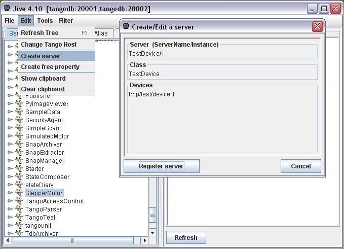
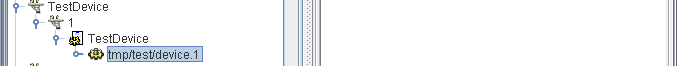
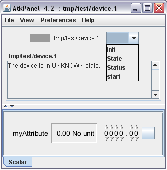

This paper is a documentation intended for developers. It described how to build a Java Tango Device. A background in the Java language is strongly recommended. The pre-requisites are:

* The Tango concepts: attribute, command, device property…  Please read the Tango reference manual : [tango-controls.org](http://www.tango-controls.org/), [tango-controls documentation](http://tango-controls.readthedocs.io)

* The Java language Standard Edition : http://www.oracle.com/technetwork/java/javase/documentation/index.html

* The concept of annotations introduced in Java version 5: http://docs.oracle.com/javase/tutorial/java/javaOO/annotations.html

* Java beans : http://en.wikipedia.org/wiki/JavaBeans

# A first device

Here is the code of a simple device class with one Tango command and one attribute (see annexes for full code):

```java
@Device
public class TestDevice {

    private final Logger logger = LoggerFactory.getLogger(TestDevice.class);
    /**
     * Attribute myAttribute READ WRITE, type DevDouble.
     */
    @Attribute
    public double myAttribute;

    /**
     * Starts the server.
     */
    public static void main(final String[] args) {
	ServerManager.getInstance().start(args, TestDevice.class);
    }

    /**
     * init device
     */
    @Init
    public void init() {
	logger.debug("init");
    }

    /**
     * delete device
     */
    @Delete
    public void delete() {
	logger.debug("delete");
    }

    /**
     * Execute command start. Type VOID-VOID
     */
    @Command
    public void start() {
	logger.debug("start");
    }

    /**
     * Read attribute myAttribute. 
     * 
     * @return
     */
    public double getMyAttribute() {
	logger.debug("getMyAttribute {}", myAttribute);
	return myAttribute;
    }

    /**
     * Write attribute myAttribute
     * 
     * @param myAttribute
     */
    public void setMyAttribute(final double myAttribute) {
	logger.debug("setMyAttribute {}", myAttribute);
	this.myAttribute = myAttribute;
}
```

Before starting this device, it has to be declared in the Tango database with Jive menu “Create server”.  Hereafter, a server “TestDevice/1” with one device “tmp/test/device.1” is created:



The newly added device must appear in the device tree:



As the TestDevice class of this device has a main method, it can be started as a standard Java program:

1. A Java system property “TANGO_HOST” must be defined. For instance “tangodb:20001,tangodb:20002” , like in the Jive screenshot above.

2. The mandatory program argument is the instance name (1 in above example).

Once started, the device can be tested. Here is an example of the Tango generic client ATKPanel:



> NB: In Tango, the commands Init, State, Status and the attributes State, Status are created by default for any device.

Here is a first code explanation:

* The __@Device__ annotation on a class defines this class as a Tango Device.

* The __@Attribute__ annotation defines a field as a Tango attribute: 
    - The attribute type is defined by the field type;  
    - If this field has a getter, it is a READ attribute; 
    - If it has a setter, it is a WRITE attribute; 
    - If it has both getter and setter, it is a READ/WRITE attribute.

* The annotation __@Command__ defines a method as a Tango command:
    - The parameter type defines the input type
    - The return type defines the output type

* The __@Init__ annotation defines a method called:
    - At server startup; 
    - When “Init” command is called.

* The __@Delete__ annotation defines a method called:
    - At server shutdown;
    - At “Init” command, just before __@Init__.

* The main method starts the server

* The logger field is to log. 

The following chapters will describes all this in details.

