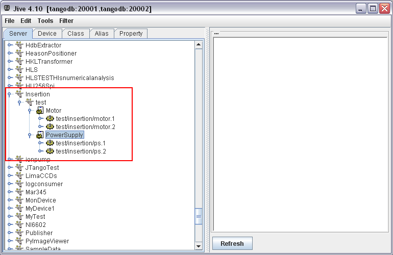
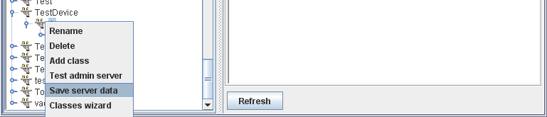

## Server with Tango Database 
A device class may contain a main method to start its server. It should call “start” of org.tango.server.ServerManager. 

```java
public static void main(final String[] args) {
  ServerManager.getInstance().start(args, TestDevice.class);
}
```

When using the Tango database, the java system property or environment variable TANGO_HOST must be defined to indicate the host and port of the database. The string array passed in the start method must contain at least the instance name as it has been previously defined in the Tango database. The other options are:

* The "-h" option displays the list of instances declared in the tango database for the given server.

* The “–v x“ option allows to override the default logging level (also called root level) of the logging configuration file where x is a integer value (possible values are OFF=0,  FATAL = 1, ERROR = 2, WARN = 3, INFO = 4, DEBUG = 5, TRACE = 6)

It is possible to have several classes in a single server. Here is an example of a server started with two classes (org.tango.Motor and org.tango.PowerSupply): 

```java
// add class org.tango.Motor to the server (to be declared as “Motor” in the tango db)
ServerManager.getInstance().addClass(org.tango.Motor.class.getSimpleName(), org.tango.Motor.class);
// add class org.tango.PowerSupply to the server (to be declared as “PowerSupply” in the tango db)
ServerManager.getInstance().addClass(org.tango.PowerSupply.class.getSimpleName(),org.tango. PowerSupply.class);
// start the server “Insertion/test”
ServerManager.getInstance().start(new String[] {"test"}, "Insertion");
```

The following screenshot shows an example declaration of the server “Insertion/test” in the tango db; it contains 4 devices, 2 of class Motor and 2 of class PowerSupply:



## Device without Tango database

A device may also be started without a Tango database, for example to perform unit tests. The system property OAPort (used by JacORB) must specify the port on which the server is started. The following code starts a device “1/1/1” on the port 12354 (NB: a client will connect to it with an address like "tango://localhost:12354/1/1/1#dbase=no")

```java
public static final String NO_DB_DEVICE_NAME = "1/1/1";
public static final String NO_DB_GIOP_PORT = "12354";
public static final String NO_DB_INSTANCE_NAME = "1";

…
System.setProperty("OAPort", NO_DB_GIOP_PORT);
ServerManager.getInstance().start(new String[] { NO_DB_INSTANCE_NAME, "-nodb", "-dlist", NO_DB_DEVICE_NAME },
		TestDevice.class);
```

The start options are for a no db server:

* `-nodb` to indicate a server without database

* `-dlist` the list of devices in the server

* `-file=` the properties file. As the device and class properties are normally defined in the Tango DB, a file can be specified to replace it. (Refer to annexes for an example).  If the device started without database is also defined in tango db, it is possible to generate its file with Jive. The “Save server data” menu is accessible by right-clicking on the instance name:



Example:

```java
System.setProperty("OAPort", NO_DB_GIOP_PORT);
ServerManager.getInstance().start(
		new String[] { NO_DB_INSTANCE_NAME, "-nodb", "-dlist", NO_DB_DEVICE_NAME,
			"-file=" + TestDevice.class.getResource("/noDbproperties.txt").getPath() }, TestDevice.class);
```